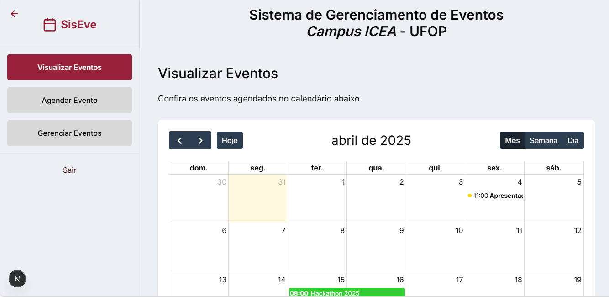

# **CSI606-2024-02 - Proposta de Trabalho Final**

## *Discente: Unaê Antunes Tupinambás*

<!-- Descrever um resumo sobre o trabalho. -->

### Resumo

O sistema de gerenciamento de entretenimento no ICEA (campus da Universidade Federal de Ouro Preto) será desenvolvido para centralizar processos relacionados à organização de eventos, oferecendo uma plataforma acessível e eficiente para docentes, discentes, técnicos administrativos e terceiros.

<!-- Apresentar o tema. -->
### 1. Tema

O trabalho final tem como tema o desenvolvimento de um sistema web para gerenciamento de entretenimento no ICEA. O projeto tem como objetivo estimular a realização de eventos no campus e simplificar o acesso às informações e à agenda de cada atividade. Além de disponibilizar todos os detalhes sobre os eventos, o sistema permitirá que os usuários façam a solicitação de agendamento diretamente pela plataforma. Dessa forma, será possível centralizar todos os processos, desde a solicitação de materiais até o controle administrativo pela instituição, eliminando a necessidade de buscar responsáveis de forma dispersa no campus e proporcionando uma gestão mais prática e organizada.

Os objetivos específicos incluem:

- Modelar e implementar uma aplicação web para gerenciamento de eventos no campus.

- Disponibilizar uma interface intuitiva para cadastro, consulta e solicitação de eventos.

- Possibilitar a solicitação e aprovação de eventos e materiais necessários.

- Implementar um sistema de notificações para manter os usuários informados sobre seus eventos

<!-- Descrever e limitar o escopo da aplicação. -->
### 2. Escopo

Este projeto terá as seguintes funcionalidades: 

- **Cadastro e Autenticação de Usuários:** 
registro de usuários com diferentes perfis (estudantes, professores, administradores), login seguro com autenticação via senha e, possivelmente, integração com o sistema da instituição.

- **Gerenciamento de Eventos:**
cadastro de eventos com informações detalhadas (nome, data, local, descrição, responsáveis), solicitação de agendamento diretamente pela plataforma, aprovação e gerenciamento de solicitações pela administração do ICEA, controle de materiais necessários para cada evento.

- **Consulta e Notificação:** visualização da agenda de eventos confirmados, sistema de notificações para lembrar e informar os usuários sobre seus eventos.

- **Relatórios e Administração:**
feedback dos usuários, gerenciamento de permissões dos usuários administrativos.

**Tecnologias Previstas:**
*FRONT:*
TypeScript - Linguagem principal, oferecendo tipagem estática para melhor segurança e desenvolvimento
JavaScript - Base da linguagem TypeScript
HTML - Estruturação do conteúdo
CSS - Estilização (via Tailwind CSS)

Next.js 14 - Framework React com App Router para renderização híbrida (SSR/CSR)
React 18 - Biblioteca para construção de interfaces de usuário
Tailwind CSS - Framework CSS utilitário para estilização rápida e responsiva

*BACK*
JavaScript (ES6+) - Linguagem principal utilizada para o desenvolvimento do backend.
Node.js - Ambiente de execução para JavaScript no lado do servidor.
Express.js - Framework web minimalista para criar rotas e gerenciar requisições HTTP.

*BD*
SQLite - Banco de dados leve e embutido, utilizado para armazenar os dados do projeto.

<!-- Apresentar restrições de funcionalidades e de escopo. -->
### 3. Restrições

Neste trabalho não será considerada a implementação completa do software. O projeto será continuado no trabalho de conclusão de curso.

<!-- Construir alguns protótipos para a aplicação, disponibilizá-los no Github e descrever o que foi considerado. //-->
### 4. Protótipo

  Protótipos para as páginas de login e página inicial foram elaborados, e podem ser encontrados em https://www.figma.com/design/8qOTEyMJBoKdnYhTZe3sI3/Sistema-de-Gerenciamento-de-Evento-do-ICEA?node-id=0-1&t=wyoRocqT0g3cl3b6-1

### 5. Conclusão

Como está explícito nas 'Restrições', este projeto se inicia na disciplina de Sistemas Web 1 e termina na conclusão do TCC 2. Portanto, para a disciplina eu implementei parte das funcionalidades: 

- Modelagem de BD para: usuarios (ainda não possui adm) e eventos (ainda não possui aprovação por adm) 
- Tela de login
- Tela de visualização dos eventos
- Tela de gerenciamento de eventos (de acordo com o id do usuario)
- Tela de agendamento de eventos

